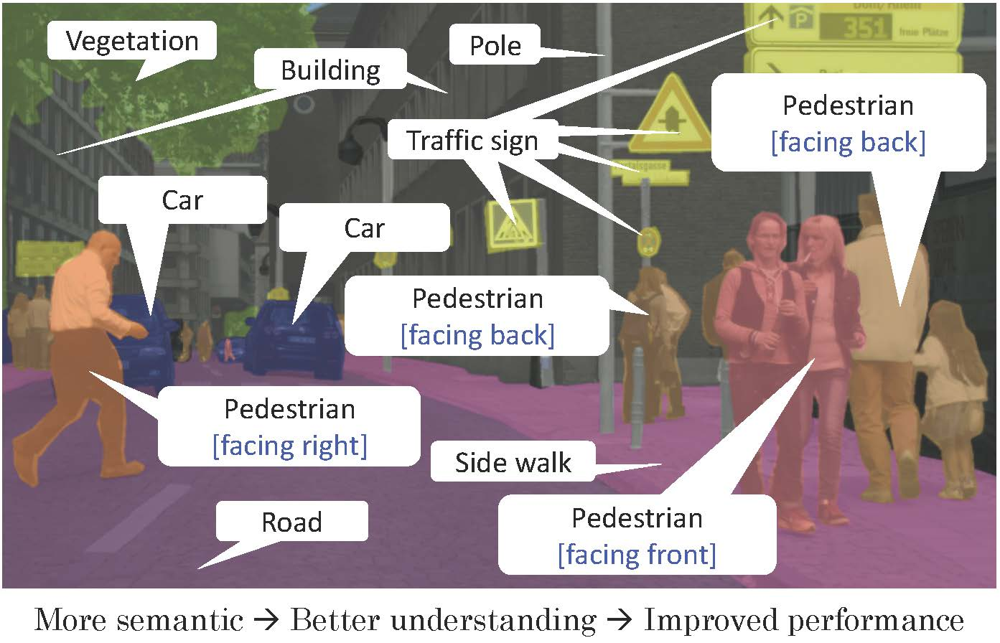
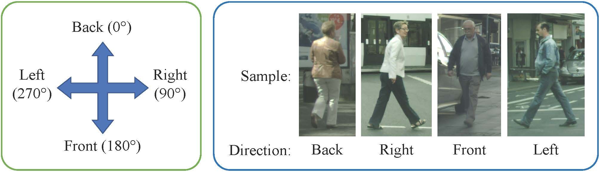
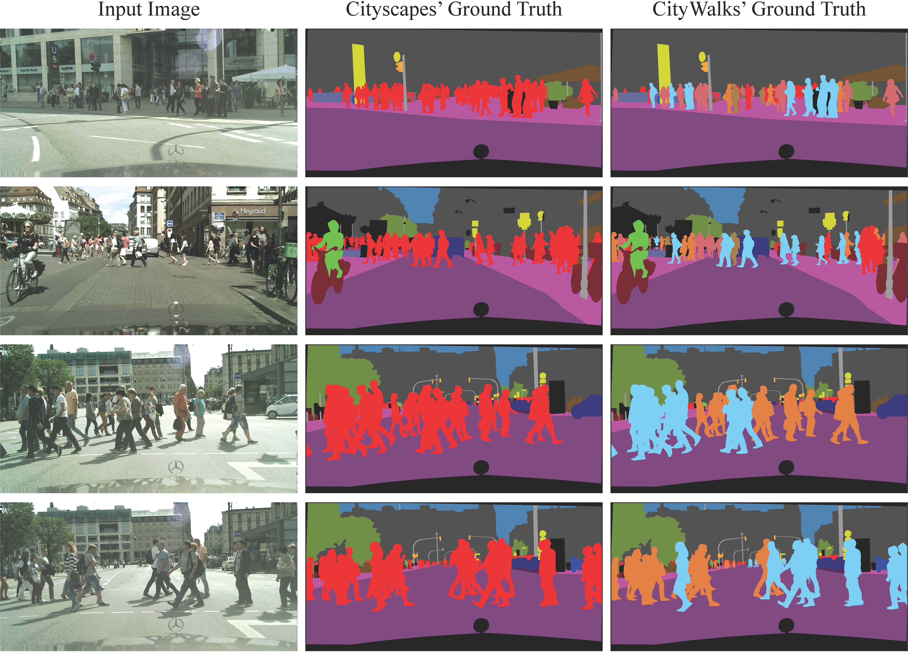
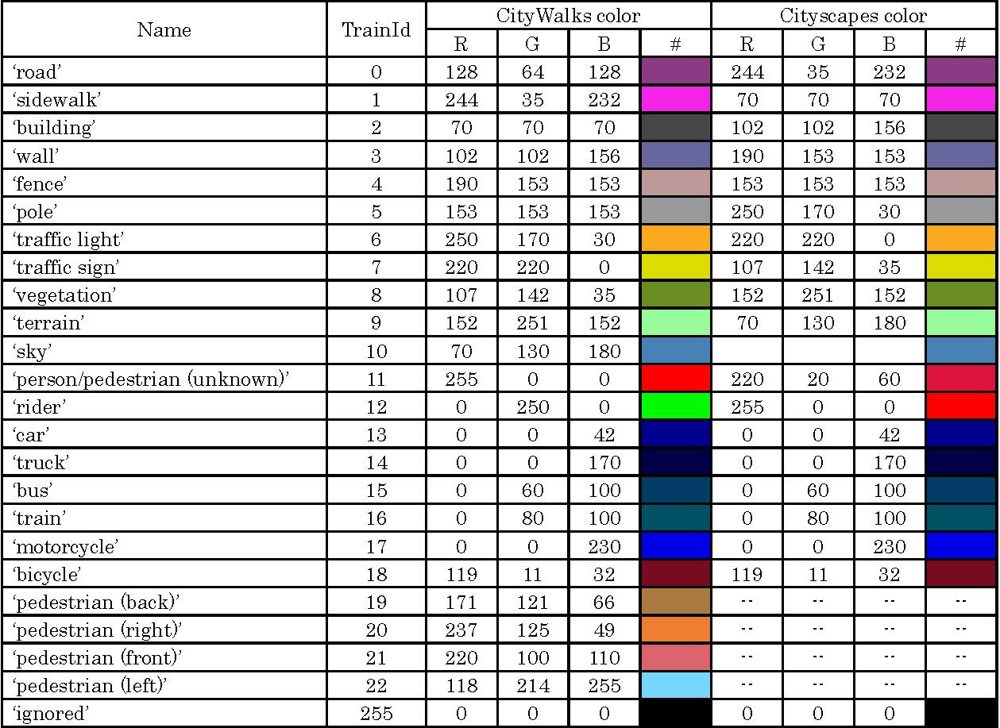
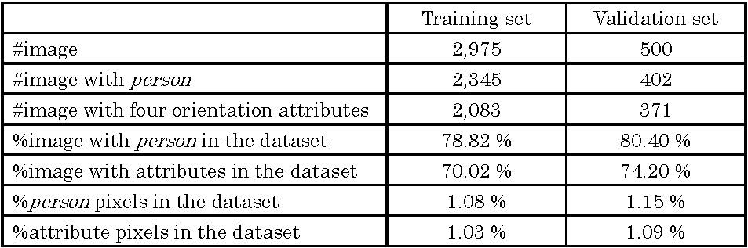
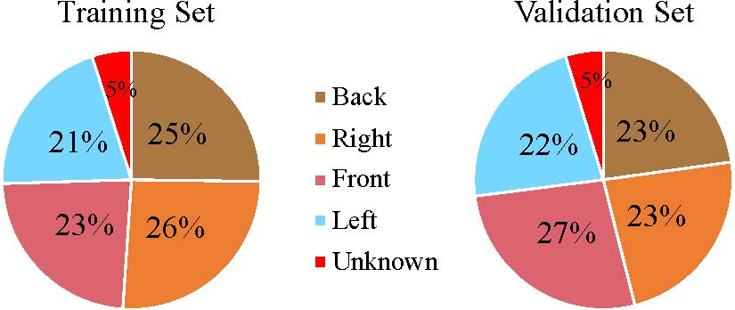

# The CityWalks #


### Introduction ###



Semantic segmentation nowadays becomes an interesting topic to many researchers and practitioners in the fields of machine learning and computer vision. There are numerous challenges that are publicly available; one of them is the Cityscapes which is very popular in the semantic segmentation task intended for autonomous driving applications. However, the Cityscapes provides the annotations to only learn the name of objects. Meanwhile, for traffic scene understanding purposes, additional information describing a particular object such as its attributes is important to enrich the semantic information and may help improve the segmentation performance.

We construct the CityWalks, which is an extension of the [Cityscapes dataset](https://www.cityscapes-dataset.com/), by re-annotating the original ground truth with additional labels corresponding to four pedestrian’s body orientations. It is constructed to challenge the attribute-aware semantic segmentation task aimed at understanding the pedestrians’ walks. Information regarding pedestrian’s moving orientation is meaningful and important for driving assistant and possible risk avoidance.

The re-annotation process is applied to the original Cityscapes’ ground truth provided in training and validation sets, containing 2,975 and 500 images, respectively. The ground truth re-annotation was conducted manually and very carefully by appointed annotators with considering details in pixel-level using a conventional image editor. By extending the class person into four classes representing pedestrian’s orientation classes (back, right, front, and left) and preserving the original class of person, the CityWalks provides trainable 23 classes encoded in ‘trainId’.

Guide in the re-annotation process with pedestrian’s body orientations



Examples comparing the ground truths from the original Cityscapes and the CityWalks



Labels and colors provided by the CityWalks for the 23 trainable classes



Statistic of the CityWalks



Distributions of pedestrian orientations annotated in the CityWalks




### Download the dataset ###

The CityWalks will be publicly available as a third party contributor to the basis Cityscapes dataset (location: [https://www.cityscapes-dataset.com/downloads/](https://www.cityscapes-dataset.com/downloads/)). The downloaded package will include:
1. Annotated ground truth
   * gtFine_color: train, val
   * gtFine_labelid: train, val
   * gtFine_trainid: train, val
2. Supplementary scripts and files that support the CityWalks


### How to Use the Data? ###

1. Download the CityWalks package, place the extracted folders and files into your designated directory.
2. It is recommended to use a .txt file to list all input and ground truth pairs for training your model; Use provided scripts to create the lists.
3. Ensure your model has been set with 23 classes for the number of final layer's output.
4. Train your model using the CityWalks, as how you train a semantic segmentation model.
You can also refer to our repository for further discussion: [https://github.com/muralabmahmuds/CityWalksScripts](https://github.com/muralabmahmuds/CityWalksScripts).


### Citation ###

If you find this dataset useful, please, kindly cite the following papers:

```
#!bibtex
@article{sulistiyo2020ieice,
  title={Attribute-Aware Loss Function for Accurate Semantic Segmentation Considering the Pedestrian Orientations},
  author={Sulistiyo, Mahmud Dwi and Kawanishi, Yasutomo and Deguchi, Daisuke and Ide, Ichiro and Hirayama, Takatsugu and Zheng, Jiang-Yu and Murase, Hiroshi},
  journal={IEICE Transactions on Fundamentals of Electronics, Communications and Computer Sciences},
  volume={103},
  number={1},
  pages={231--242},
  year={2020},
  publisher={The Institute of Electronics, Information and Communication Engineers}
}
@inproceedings{cordts2016cityscapes,
  title={The {Cityscapes} dataset for semantic urban scene understanding},
  author={Cordts, Marius and Omran, Mohamed and Ramos, Sebastian and Rehfeld, Timo and Enzweiler, Markus and Benenson, Rodrigo and Franke, Uwe and Roth, Stefan and Schiele, Bernt},
  booktitle={in Proc. 2016 IEEE Conf. on Computer Vision and Pattern Recognition},
  pages={3213--3223},
  month={June},
  year={2016}
}
```

---------------------------------------------------------------------------------------------------------------------
This material is presented to ensure timely dissemination of scholarly and technical work. Copyright and all rights therein are retained by authors or by other copyright holders. All persons copying this information are expected to adhere to the terms and constraints invoked by each author’s copyright. In most cases, these works may not be reposted without the explicit permission of the copyright holder.
